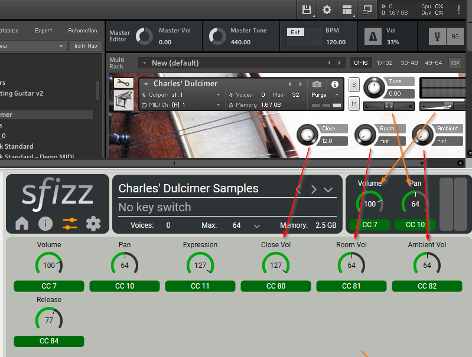
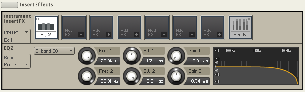
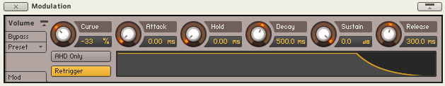

# Charles' Dulcimer recorded by Luis Filip Costa

    Charles’ Dulcimer is a beautiful Hammer Dulcimer made of solid wood with 9 courses of strings on the treble bridge and 8 courses of strings on the bass bridge, recorded by Luis Filip Costa. It has two octaves and a sweet, rich and resonating sound.

    The instrument was extensively sampled with three different mic positions: a close perspective, a room and an ambient/hall perspective at the Coomberhust Studio Concert Hall at Kingston University.

    * 3.29GB in size
    * 3 different mic positions (close, room and hall)
    * One velocity layer and 7 round robins

The free Kontakt instrument, with samples, is available via:

* https://vstbuzz.com/freebies/charles-dulcimer/

The documentation included with the Kontakt instrument is useful to read - especially about the use of the sustain pedal / cc 64. 

## SFZ Controls

Image showing the matching controls in a SFZ (SFIZZ) player compared to the Kontakt instrument:

## SFZ Notes

* There are 7 wav files per mic in the original, but wav files 5 - 7 (for each mic) turn out to be duplicates of one of the first 4 files. The Kontakt instrument does not make use of the files 5 - 7 for each mic, so I am not sure why they are included. In other words, there are only 4 'real' round robins, with the final 3 created from 'transposed' notes from files 1 - 4.
* The  mic wav files contain all the samples for that mic. The offset and end points for each note within those are copied from the Kontakt instrument.
* The sustain pedal / cc64 control has been duplicated to match how Kontakt behaves. (https://sfzformat.com/opcodes/sustain_lo)
* A SFZ release control has been added for those that want more control than cc64 (on/off) provides.
* SFIZZ only: uncomment "image=./Resources/pictures/wallpaper.png" if you want to use the instruments background image.

Finally, a thanks to the authors of [AHK](https://www.autohotkey.com) for helping me to automate the process - without which my patience would of run out long before I completed copying out the offset and end points of the samples from Kontakt. And AudioJunkie for the SFZ template [Audiojunkie SFZ Template](https://github.com/sfzinstruments/sfztemplates/blob/main/audiojunkie_template.sfz)

## To use

* Place the SFZ file in the Charles' Dulcimer folder beside the 'Charles' Dulcimer.nki' file.
* Or place the SFZ file elsewhere and modify the path to the samples in the SFZ.
* To add sustain to the instrument - use a sustain pedal, or change cc64 >= 64 in your DAW. Alternatively, use the added 'Release' control - which is simpler and gives more control.

## ToDos

* Explore matching these Kontakt settings more closely:

